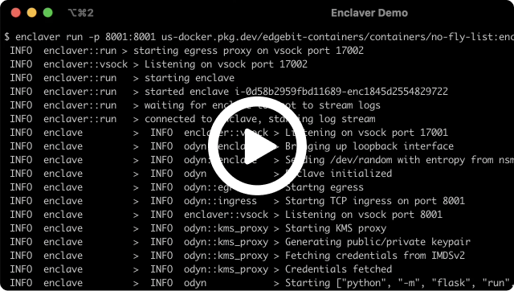
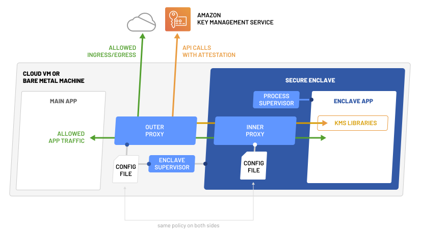

Enclaver is an open source toolkit created to enable easy adoption of software enclaves, for new and existing backend software.

Enclaves provide several critical features for operating software which processes sensitive data, including:

 - **Isolation:** Enclaves enable a deny-by-default approach to accessing process memory. Software running in an enclave can expose interfaces for accessing specific data, while disallowing humans or other software on the same computer from reading arbitrary data from memory.
 - **Attestation:** Enclaves make it possible to determine the exact identity and configuration of software running in an enclave.
 - **Network Restrictions:** External communication is limited and controlled. The network policy is built into the image and therefore the software attestation.

These demos show off how your apps can use these unique features to improve privacy and security:

 - [Run a simple Python app](docs/guide-app.md) that represents a microservice or security-centric function
 - [Run Hashicorp Vault](docs/guide-vault.md) to fully isolate it after it's unsealed

## Project State

Enclaver is currently in alpha and not intended for use in production. Enclaver currently only supports [AWS Nitro Enclaves](https://aws.amazon.com/ec2/nitro/nitro-enclaves/); support for Azure Confidential VMs, GCP Confidential VMs, and arbitrary SGX and OP-TEE enclaves is on the roadmap.

 - [Getting started guide](docs/getting-started.md)
 - [Deploy an enclave on AWS](docs/deploy-aws.md)
 - [Deploy an enclave on Kubernetes](docs/deploy-kubernetes.md)

## Architecture

Read the [architecture doc](docs/architecture.md) for the full details. Enclaver consists of 3 interrelated pieces of software: 

 - `enclaver` CLI for build and run
 - “Outer Proxy” + Enclave Supervisor
 - “Inner Proxy” + Process Supervisor

## FAQ

See [the FAQ](docs/faq.md) for common questions and a comparison of Enclaver to similar technologies.

## Reporting Security Bugs

Report security bugs confidentially at https://edgebit.io/contact
